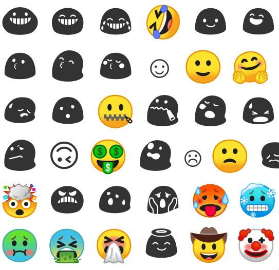

I love NixOS, but one issue that I have had since I installed it is how messed
up the default font config is, in particular emojis don't work correctly.

My gripe is that, after installing a bunch of fonts I like, it will give
priority to fonts which have old emoji glyphs (in black and white).

You can see at least 3 fonts working in there, and I'm not exactly sure whether or not there's more.

## Fontconfig
A classic blog post if you want to learn about fontconfig is [I stared into the fontconfig, and the fontconfig stared back at me](https://eev.ee/blog/2015/05/20/i-stared-into-the-fontconfig-and-the-fontconfig-stared-back-at-me/). It's a bit long, so the short of it is
- it's far too complicated

Most linux distros these days have a reasonable default which includes emojis 
which work, but sometimes you have to do it manually.

One solution when googling is the one found [here](https://victor.kropp.name/blog/emoji-on-linux/), which involves switching the prefered font to be Noto Color Emoji (or the emoji font you prefer).
