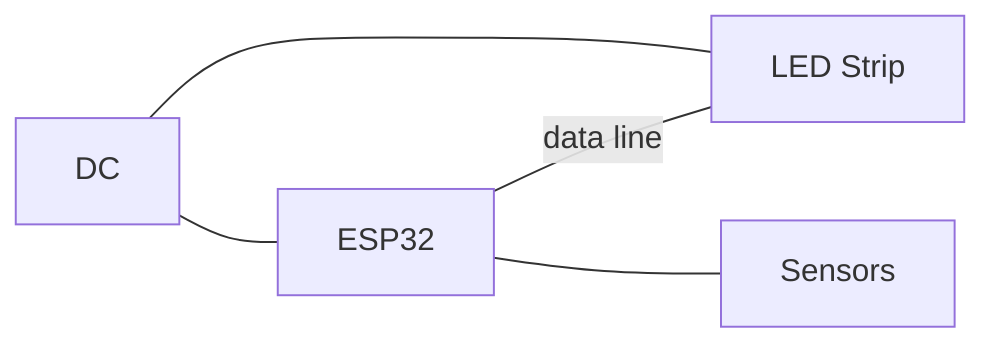

This will be the first in a series of blogposts which details how to create
a "smart" LED matrix.
I don't like the terms IOT or "smart", but I think the concept of a heads
up display is really cool, and the sudden availability of cheap internet
connected microcontrollers pretty much begs for you to make a "smart" device.

## The concept
This isn't the first time someone makes something like this, I'm not even going
to claim that I'll make the best iteration of one of these. 
The amount of projects like these do encourage me, as it doesn't sound that hard
to make as a beginner maker project.

Ideally my screen would look something like this

inspired by the reddit post [here](https://www.reddit.com/r/DIY/comments/6c50r3/16x16_led_matrix/).

## Parts list
You can replace a lot of these with equivalent parts, I might even end up replacing some of these down the lines, in which case I'll edit the list somehow.
- A frame
- A diffuser
- Some material to separate the pixels
- ESP32 microcontroller
- A power supply (I'll use an old 5V power supply I found, I already know it can drive 300 pixels)
- DC hat for ESP32
- A real time clock (It will be primarily used as a clock)
- SD card reader
- Temperature/humidity sensor

A lot of these things are optional, and you can work out whether you want to have a small weather station built into the frame, however, I like trying out weird stuff like this, and it will end up being interesting.

## Basic circuit diagram
Since I only have a basic graph editor, I can only make a basic sketch of how it would work.

## The part where I justify my decisions
Here's some questions you might be asking yourself.

*"Is there enough RAM?"*  
Yes, probably. Storing a full 16x16 matrix will take 256 pixels, if handled by
the FastLED library, each pixel is composed of 3 bytes, so 256 pixels would be 768 bytes.
If we use a buffer of 4 frames, it will be 3kB of memory. The ESP32 has 520KiB of RAM, so it's probably enough.

*"Why did I pick that MCU?"*  
The ESP32 is incredibly cheap. It's also so much better than the ESP8266, and
it allows me to do some weird things (such as running a React server on it).

*"How much time will it take"*  
Way too long, I made this blog post to force myself to work on it. If you're 
actually interested and want to pressure me into working more on it you can
email me at matrix🎩erobl.xyz. You can replace that 🎩 with the one email character.
